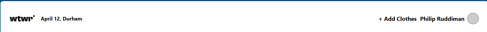
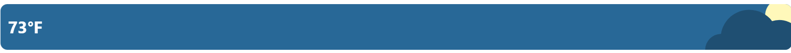
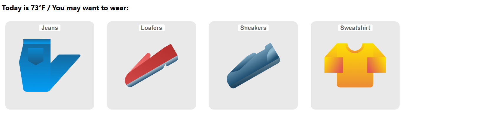
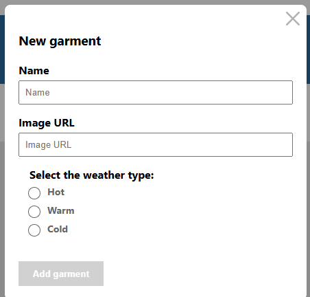
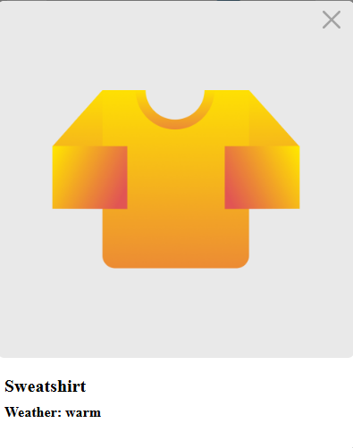
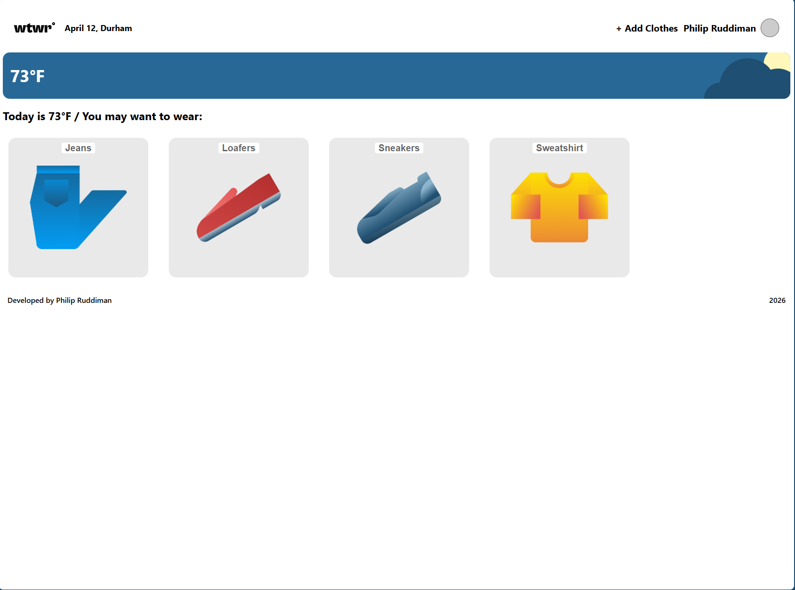

# WTWR (What To Wear?) — React + Vite

WTWR is a weather‑based wardrobe app built with React and Vite.  
It allows users to view the current weather, browse clothing items, add new items, and view item details in a clean, responsive UI.

This project was built as part of the TripleTen Software Engineering Program.

---

## Features

- **Live Weather Integration**  
  Automatically fetches weather data for the user’s location and displays temperature + conditions.

- **Dynamic Clothing Recommendations**  
  Clothing items are filtered based on the current weather.

- **Add New Clothing Items**  
  Users can add items with name, image, and weather type.

- **Item Modal**  
  Clicking an item opens a detailed modal with a full‑size image and item info.

- **Clean, Modern UI**  
  Pixel‑perfect implementation based on Figma designs.

- **Fast Development with Vite**  
  Lightning‑fast HMR and build times.

---

## 🛠 Tech Stack

- **React 18**
- **Vite**
- **JavaScript (ES6+)**
- **CSS (Figma‑accurate custom styling)**
- **Normalize.css**
- **Prettier (with .prettierignore)**
- **Weather API (OpenWeather or TripleTen-provided API)**

---

## 📁 Project Structure

se_project_react/
├── public/
├── src/
│ ├── components/
│ ├── hooks/
│ ├── utils/
│ ├── images/
│ ├── App.jsx
│ ├── index.css
│ └── main.jsx
├── .prettierignore
├── package.json
├── vite.config.js
└── README.md

## Installation & Setup

Clone the repo:

git clone <your-repo-url>
cd se_project_react

Install dependencies:

npm install

Start the dev server:

npm run dev

Build for production:

npm run build

Preview the production build:

npm run preview

## Deployment

This project is deployed using GitHub Pages via Vite’s base config and the gh-pages package.

To deploy:

npm run deploy

Your site will be available at:

https://<your-username>.github.io/se_project_react/

## Screenshots

Header

WeatherCard

ItemCard grid

Add Clothes modal

Item modal

FullScreen

## Demo Video

https://1drv.ms/v/c/b954ec37cb334643/IQCPhA3pjIqGQ7BYTIPqiSWkAWEsdznmCphCxndglcePiUk?e=fZeBD4

## Author

Philip Ruddiman
Tripleten Software Engineering Program

## License

This project is for educational purposes as part of the TripleTen curriculum
